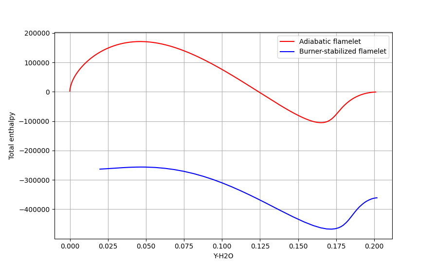
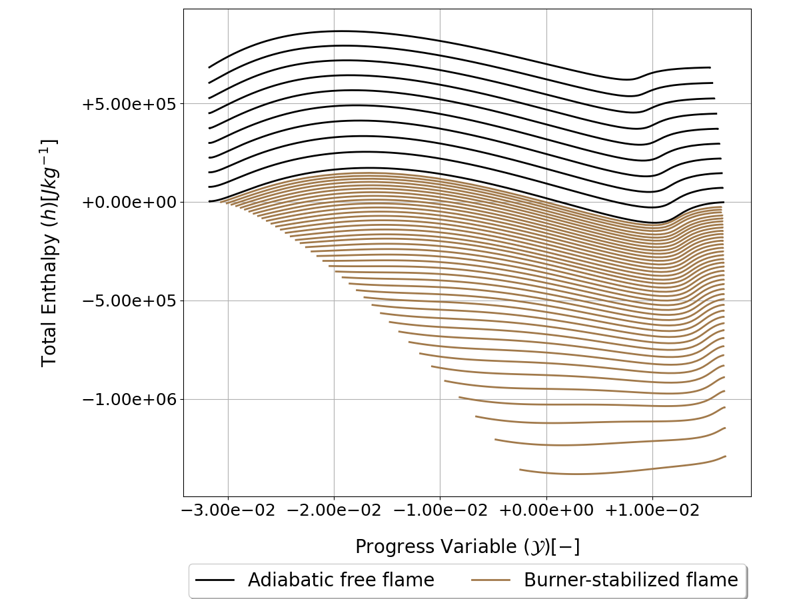
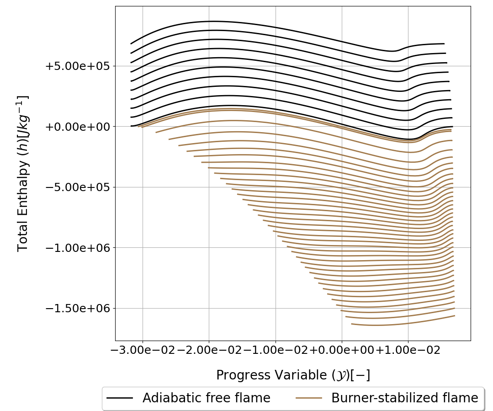

.. _burnerflame_tutorial:

Tutorial for Burner-Stabilized Flamelet Simulations
===================================================

This page contains several tutorials on how to use *SU2 DataMiner* to run simulations of burner-stabilized flamelets used to set up flamelet-generated manifolds. 

.. contents:: :depth: 2

.. _enable_burner_stabilized_flamelets:

Enabling Burner-Stabilized Flamelets 
------------------------------------

This section demonstrates how to enable burner-stabilized flamelets in *SU2 DataMiner* workflows through the configuration settings. 
The configuration created in this section will be used throughout this tutorial. The setup is very similar to that of the tutorial on :ref:`adiabatic flamelets <freeflame_tutorial>`.

The code snippet below shows how to generate a *SU2 DataMiner* configuration for FGM applications of hydrogen-air flames with preferential diffusion.

.. code-block::

    from su2dataminer.config import Config_FGM 

    config = Config_FGM()

    config.SetConfigName("burnerstabilized_flamelets")

    # Hydrogen-Oxygen submechanism extracted from GRI-Mech 3.0.
    config.SetReactionMechanism("h2o2.yaml")

    # Fuel set to pure hydrogen. Oxidizer is set to air by default
    config.SetFuelDefinition(["H2"], [1.0])

    # Enable preferential diffusion in the flamelet calculations 
    config.EnablePreferentialDiffusion(True)

Burner-stabilized flamelets are not included in the manifold by default. To include burner-stabilized flamelets, the following command should be used. 

.. code-block::

    # Burner-stabilized flamelets are enabled with the label "BURNERFLAME"
    config.includeFlameletType("BURNERFLAME")

In addition to burner-stabilized flamelets, the manifold generated in this tutorial will contain adiabatic flamelets, as those are included by default.
See the :ref:`documentation page <FGM>` for more details on how to include or exclude specific flamelet types from the manifold.

The number of flamelets the manifold is defined in the code snippet below. The configuration is similar to that of the tutorial for :ref:`adiabatic flamelets <freeflame_tutorial>`, with additional specification for the number of burner-stabilized flamelets.
In this tutorial, burner-stabilized flamelets are generated for 20 linearly spaced values of the mass flow rate varying between 98% and 0.1% of the adiabatic value.

.. code-block::

    # Adiabatic flamelets are generated for 20 values of the reactant 
    # temperature linearly spaced between 300 and 800 Kelvin.
    config.SetUnbTempBounds(300.0, 800.0)
    config.SetNpTemp(20)

    # Burner-stabilized flamelets are generated for 20 values for 
    # the mass flow rate. 
    config.SetNpMdot(20)

    # The reactant equivalence ratio ranges for 10 linearly spaced 
    # values between 0.3 and 1.5.
    config.DefineMixtureStatus(False)
    config.SetMixtureBounds(0.3, 1.5)
    config.SetNpMix(10)

    # Display configuration information in the terminal and save.
    config.PrintBanner()
    config.SaveConfig()

.. _burnerflame_manual:

Running Individual Flamelet Simulations 
---------------------------------------

This section shows how to manually run simulations for burner-stabilized flamelets.
The adiabatic mass flux is required to configure the inflow boundary condition of the burner-stabilized flamelet solver. 
The adiabatic mass flux can be obtained from the :ref:`adiabatic flamelet solver <flamelet_solver_adiabatic>`, which is why we 
initialize an instance of the :code:`FreeFlameSolver` alongside the :code:`BurnerFlameSolver` in this tutorial.

.. code-block::

    from su2dataminer.config import Config_FGM 
    from su2dataminer.generate_data import FreeFlameSolver, BurnerFlameSolver

    # Load configuration
    config = Config_FGM("burnerstabilized_flamelets.cfg")

    # Initialize adiabatic flamelet solver
    freeflame = FreeFlameSolver(config)
    burnerflame = BurnerFlameSolver(config)

The burner-stabilized flamelet is generated at an equivalence ratio of 0.8 with a burner temperature of 300 Kelvin and 50% of the adiabatic mass flux.
The burner temperature and equivalence ratio can be directly imposed. The code snippet below shows how to retrieve the value of the inflow mass flux.

.. code-block::

    # Reactant and burner temperature
    Tu = 300

    # Equivalence ratio 
    phi = 0.8 

    # Retrieve the adiabatic mass flux by simulating an adiabatic flamelet with the same inflow conditions.
    freeflame.setMixtureStatus(phi)
    freeflame.setReactantTemperature(Tu)
    freeflame.startSolver()
    mflux_adiabatic = freeflame.getMassFlowRate()

    # Inflow mass flux set to 50% of the adiabatic value.
    mflux_burnerflame = 0.5*mflux_adiabatic 

The code snippet below shows how to specify the inflow conditions for the burner-stabilized flamelet solver and visualizes the solution alongside the solution of the adiabatic flamelet.

.. code-block::

    # Specify inflow boundary conditions.
    burnerflame.setMixtureStatus(phi)
    burnerflame.setReactantTemperature(Tu)
    burnerflame.setReactantMassFlow(mflux_burnerflame)

    burnerflame.startSolver()

    solution_freeflame = freeflame.getSolution()
    solution_burnerflame = burnerflame.getSolution()

    import matplotlib.pyplot as plt 
    plt.plot(solution_freeflame["Y-H2O"],solution_freeflame["EnthalpyTot"], 'r', label="Adiabatic flamelet")
    plt.plot(solution_burnerflame["Y-H2O"],solution_burnerflame["EnthalpyTot"], 'b', label="Burner-stabilized flamelet")
    plt.xlabel("Y-H2O")
    plt.ylabel("Total enthalpy")
    plt.legend()
    plt.grid()
    plt.show()

As shown in the figure below, the total enthalpy of the burner-stabilized flamelet solution is notably lower than that of the adiabatic flamelet. 

    Trends of the total enthalpy of an adiabatic flamelet (red) and of a burner-stabilized flamelet computed with 50% of the adiabatic mass flux (blue).

.. _burnerflame_batch:

Running Batched Burner-Stabilized Flamelet Simulations 
------------------------------------------------------

Burner-stabilized flamelets can also be generated in batches by incrementally changing the inflow boundary conditions and saving the converged solutions in csv files.
For burner-stabilized flamelets, the default method for changing the inflow conditions is to linearly vary the inflow mass flux for a specified number of values between 98% and 0.1% of the adiabatic value.
The code snippet below shows how to generate adiabatic and burner-stabilized flamelet solutions in batches for the equivalence ratio of 0.8. 

.. code-block::

    from su2dataminer.config import Config_FGM 
    from su2dataminer.generate_data import FreeFlameSolver, BurnerFlameSolver

    # Load configuration
    config = Config_FGM("burnerstabilized_flamelets.cfg")

    # Initialize adiabatic flamelet solver
    freeflame = FreeFlameSolver(config)
    burnerflame = BurnerFlameSolver(config)

    Tu = 300
    phi = 0.8 

    # First compute adiabatic flamelet solutions.
    freeflame.solveForMixtureStatus(phi)

    # Retrieve adiabatic mass flux and then calculate burner-stabilized flamelet solutions.
    mflux_adiabatic = freeflame.getMassFlowRate()
    burnerflame.setAdiabaticMassFlow(mflux_adiabatic)
    burnerflame.solveForMixtureStatus(phi)

The solutions for the burner-stabilized flamelets will be saved in a folder titled :code:`burnerflame_data`. The figure below shows the enthalpy trends of the adiabatic and burner-stabilized solutions generated by running the previous code snippet. 

    Total enthalpy trends of adiabatic flamelets (black) and of burner-stabilized flamelets (brown) generated by linearly varying the inflow mass flux.

As an alternative to linearly varying the mass flux, it is also possible to specify the change in the inflow total enthalpy between adjacent flamelet solutions. See the :ref:`documentation page <flamelet_solver_burnerstabilized>` for more details.
This alternative method is automatically enabled when the value of the enthalpy offset is specified, demonstrated in the code snippet below.

.. code-block::

    freeflame.solveForMixtureStatus(phi)
    mflux_adiabatic = freeflame.getMassFlowRate()

    burnerflame.setAdiabaticMassFlow(mflux_adiabatic)
    burnerflame.setTargetEnthalpySpacing(4e4)
    burnerflame.solveForMixtureStatus(phi)

    Total enthalpy trends of adiabatic flamelets (black) and of burner-stabilized flamelets (brown) generated by imposing the entalpy spacing between adjacent burner-stabilized flamelet solutions.

