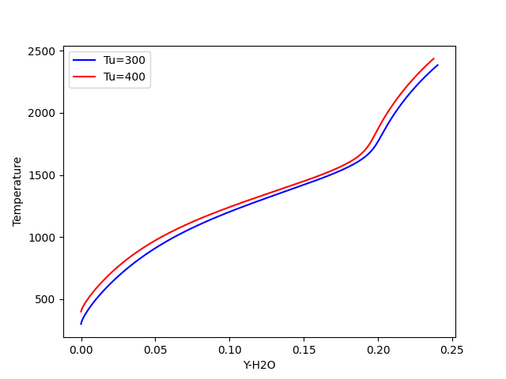
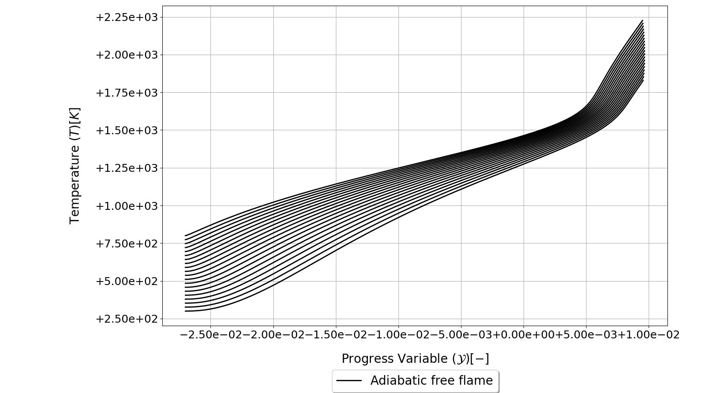

.. _freeflame_tutorial:

Tutorial for Adiabatic Flamelet Simulations
===========================================

This page contains several tutorials on how to use *SU2 DataMiner* to run simulations of adiabatic flamelets used to set up flamelet-generated manifolds. 

.. contents:: :depth: 2

.. _enable_adiabatic_flamelets:

Enabling Adiabatic Flamelets 
----------------------------

This section demonstrates how to enable adiabatic flamelets in *SU2 DataMiner* workflows through the configuration settings. 
The configuration created in this section will be used throughout this tutorial. 

The code snippet below shows how to generate a *SU2 DataMiner* configuration for FGM applications of hydrogen-air flames with preferential diffusion.

.. code-block::

    from su2dataminer.config import Config_FGM 

    config = Config_FGM()

    config.SetConfigName("adiabatic_flamelets")

    # Hydrogen-Oxygen submechanism extracted from GRI-Mech 3.0.
    config.SetReactionMechanism("h2o2.yaml")

    # Fuel set to pure hydrogen. Oxidizer is set to air by default
    config.SetFuelDefinition(["H2"], [1.0])

    # Enable preferential diffusion in the flamelet calculations 
    config.EnablePreferentialDiffusion(True)

Adiabatic flamelets are included in the manifold **by default**. However, to enable the option manually, use the following command. 

.. code-block::

    # Adiabatic flamelets are enabled with the label "FREEFLAME"
    config.includeFlameletType("FREEFLAME")

See the :ref:`documentation page <FGM>` for more details on how to include or exclude specific flamelet types from the manifold.

.. code-block::

    # Flamelets are generated for 20 values of the reactant temperature linearly spaced between 300 and 800 Kelvin.
    config.SetUnbTempBounds(300.0, 800.0)
    config.SetNpTemp(20)

    # The reactant equivalence ratio ranges for 10 linearly spaced values between 0.3 and 1.5.
    config.DefineMixtureStatus(False)
    config.SetMixtureBounds(0.3, 1.5)
    config.SetNpMix(10)

    # Display configuration information in the terminal and save.
    config.PrintBanner()
    config.SaveConfig()

.. _freeflame_manual:

Running Individual Flamelet Simulations 
---------------------------------------

This section shows how to manually run flamelet simulations for adiabatic premixed flamelets. 
The adiabatic flamelet solver is initialized from the *SU2 DataMiner* configuration.

.. code-block::

    from su2dataminer.config import Config_FGM 
    from su2dataminer.generate_data import FreeFlameSolver

    # Load configuration
    config = Config_FGM("adiabatic_flamelets.cfg")

    # Initialize adiabatic flamelet solver
    f = FreeFlameSolver(config)

The boundary conditions at the inflow can be specified in two ways. The first way is by specifying the reactant temperature and mixture status separately.
In the code snippet below, the reactant temperature is set to 300 Kelvin and the equivalence ratio set to 1.0. 

.. code-block::

    # Specify an inflow temperature of 300 Kelvin for a stoichiometric mixture.
    f.setReactantTemperature(300)
    f.setMixtureStatus(1.0)

The flamelet simulation is initialized by running the :code:`startSolver()` command. By setting the verbosity level to 1, information regarding the convergence of the simulation is displayed in the terminal.

.. code-block::

    # Initiate solver and display status in the terminal.
    f.setSolverVerbose(1)
    f.startSolver()

Alternatively, the boundary conditions at the inflow can be specified through inputs to the :code:`solveFor` function. 

.. code-block::

    # Specify inflow conditions through function inputs.
    f.solveFor(reactant_temperature=300, mixture_status=1.0)

The simulation results can be accessed through the :code:`getSolution` function. This will return the computational grid, velocity, thermochemical state variables, and inflow conditions of the converged simulation results as a :code:`DataFrame`.

.. code-block::

    # Retrieve the Pandas DataFrame of the converged flamelet solution.
    solution = f.getSolution()
    
The solution can also be stored as a comma-separated file. Running the code snippet below will save the flamelet solution at the storage location specified in the configuration in the sub-folder "freeflame" and another subfolder corresponding to the equivalence ratio.

.. code-block::
    
    results_filename = f.saveSolution()

Flamelet solutions can be restarted from solution files generated by previously converged flamelet simulations. 
The code snippets below performs two adiabatic flamelet simulations. The first simulation is performed with a reactant temperature of 300 Kelvin. 
For the second flamelet, the simulation is initialized from the solution of the first flamelet and the reactant temperature is set to 400 Kelvin. 

.. code-block::
    
    # Run and save the solution for a stoichiometric flamelet at 300 Kelvin.
    flame_1 = FreeFlameSolver(config)
    flame_1.setReactantTemperature(300)
    flame_1.setMixtureStatus(1.0)

    flame_1.startSolver()
    solution_filename_1 = flame_1.saveSolution()

.. code-block::

    # Initialize a second flamelet flamelet initialized from the previous flamelet solution.
    flame_2 = FreeFlameSolver(config)
    flame_2.loadSolution(solution_filename_1)

    flame_2.setReactantTemperature(400)
    flame_2.startSolver()

.. code-block::

    # Plot the two flamelet solutions together.
    solution_1 = flame_1.getSolution()
    solution_2 = flame_2.getSolution()

    import matplotlib.pyplot as plt 
    plt.plot(solution_1["Y-H2O"], solution_1["Temperature"],'b',label='Tu=300')
    plt.plot(solution_2["Y-H2O"], solution_2["Temperature"],'r',label='Tu=400')
    plt.legend()
    plt.xlabel("Y-H2O")
    plt.ylabel("Temperature")
    plt.show()

   Trends of flamelet solutions at different reactant temperatures.

.. _freeflame_batch:

Running Batched Adiabatic Flamelet Simulations 
----------------------------------------------

Finally, adiabatic flamelets can be run in batches in order to automatically generate a large point cloud of flamelet data with minimal commands. 
Adiabatic flamelets are run in batches by generating solutions for a specified equivalence ratio or mixture fraction with the reactant temperature varying between the lower and upper value specified in the configuration.

The code snippet below shows how to generate a batch of adiabatic flamelets for an equivalence ratio of 0.6. The reactant temperature is set to 20 linearly spaced values between 300 and 800 Kelvin, according to the settings shown in :ref:`this section <enable_adiabatic_flamelets>`.

.. code-block::

    flame = FreeFlameSolver(config)
    flame.solveForMixtureStatus(0.6)

   Trends of a batch of adiabatic flamelets generated at an equivalence ratio of 0.6.
