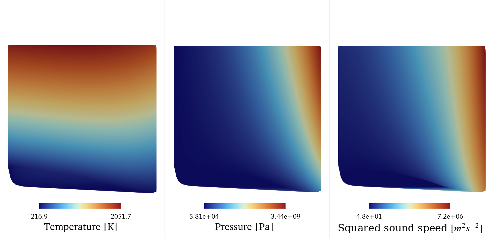
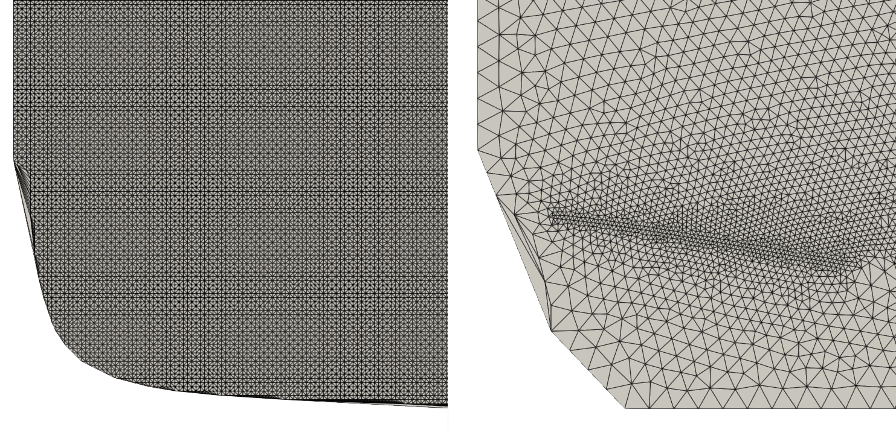
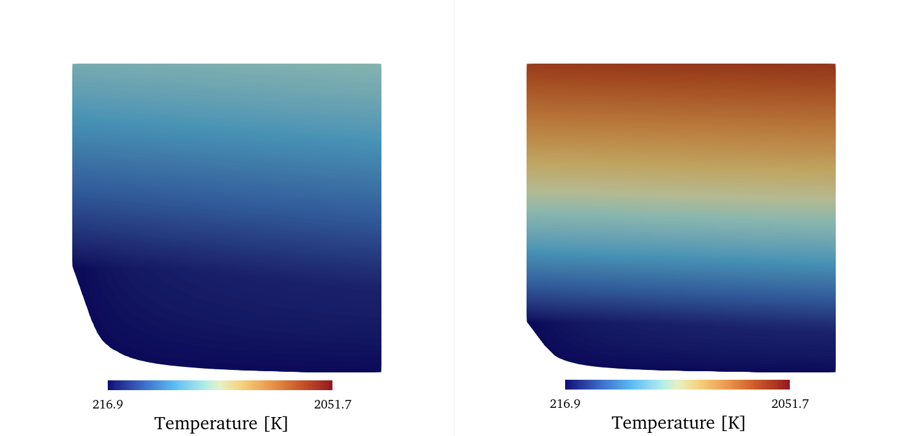
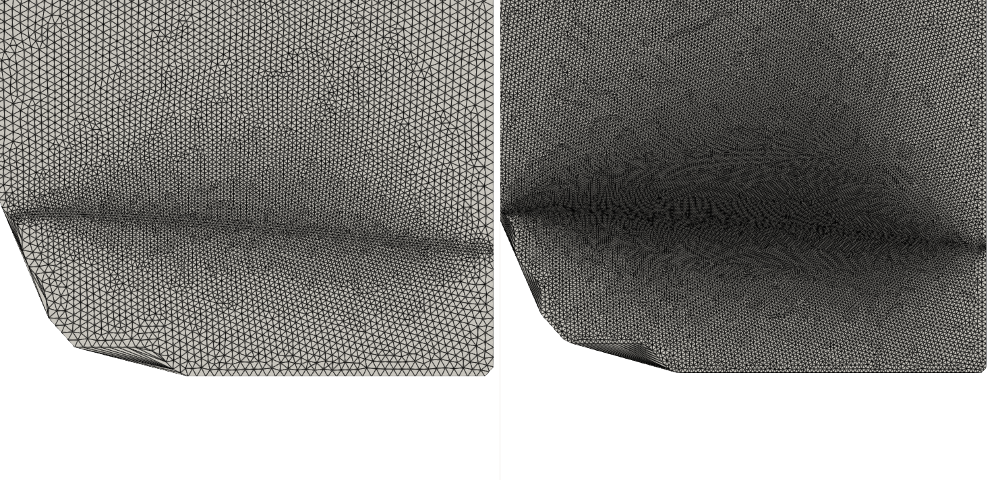
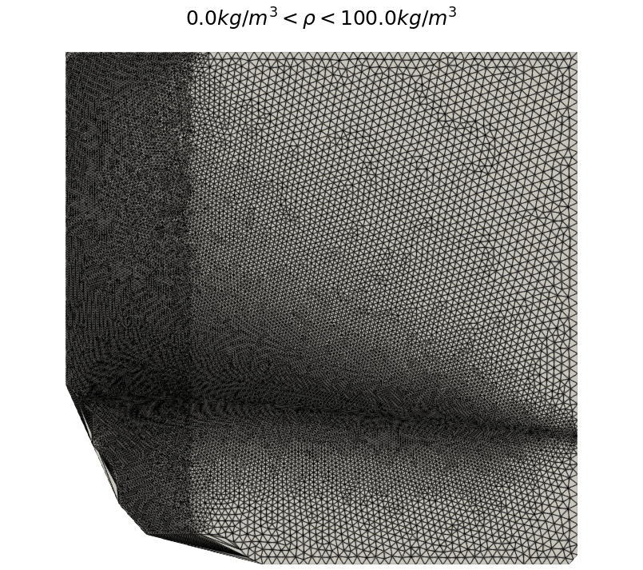
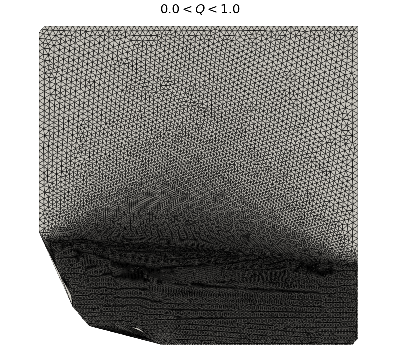
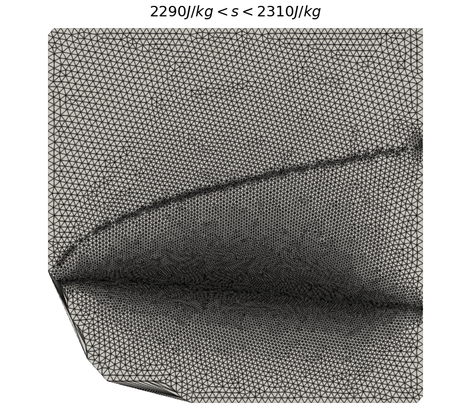
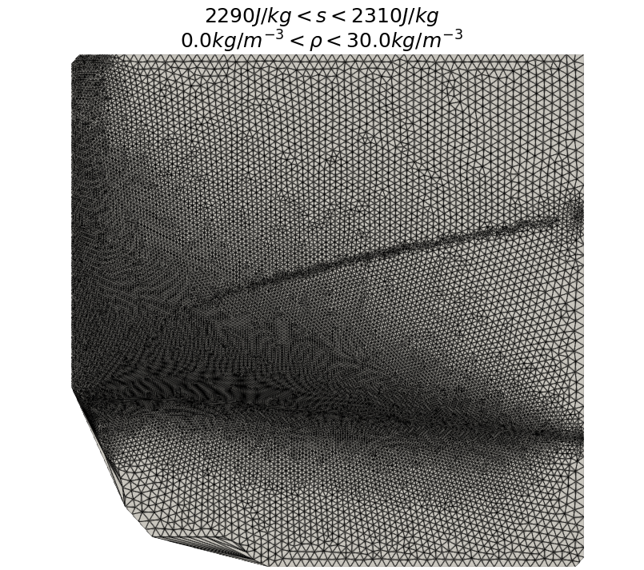

.. _NICFD_LUT: 

.. sectionauthor:: Evert Bunschoten

Table Generation for NICFD Applications 
=======================================

SU2 DataMiner supports the creation of look-up table methods for thermophyscial state evaluations in NICFD simulations in SU2. 
This tutorial showcases some of the functionalities for generating thermophyisical tables for NICFD applications in SU2. 

To get started, you will need to have installed SU2 DataMiner according to the :ref:`installation instructions <label_setup>`. 

.. contents:: :depth: 2

.. important::

    This tutorial was written for use on Linux systems. On Windows, make sure you replace the file path separator with a back-slash.

1. Config Generation
--------------------

As for any process within the SU2 DataMiner workflow, all settings regarding the setup of the fluid data generation and tabulation are stored in an SU2 DataMiner :ref:`configuration object <NICFD>`.
The tutorial for setting up a generic SU2 DataMiner configuration can be found :ref:`here <tutorialconfigs>`. 

In this example, a look-up table will be created for the application of modeling fluid properties of carbondioxide in supercritical conditions.
The following Python code snippet shows the initial set-up of the configuration object.

.. code-block::

    #!/usr/bin/env python3
    from su2dataminer.config import Config_NICFD 

    config = Config_NICFD()

    # Specify fluid and equation of state model.
    config.SetFluid("CarbonDioxide")
    config.SetEquationOfState("HEOS")

    # Automatically determine fluid data range.
    config.IncludeTransportProperties(True)
    config.UseAutoRange(True)
    config.SetNpDensity(200)
    config.SetNpEnergy(200)

    # Enable gas, liquid, two-phase, and supercritical phases.
    config.EnableGasPhase(True)
    config.EnableLiquidPhase(True)
    config.EnableTwophase(True)
    config.EnableSuperCritical(True)

    # Export configuration.
    config.SetConfigName("tabulation_carbondioxide")
    config.SaveConfig()
    config.PrintBanner()

Running this code snippet will display all relevant information of the configuration in the terminal and will save the configuration as a 
binary file titled "tabulation_carbondioxide.cfg". 

Configuration settings such as the number of nodes along the density and energy direction can later be changed when setting up the table generator.

2. Tabulation Example 
---------------------

Thermodynamic tables can be created with the :ref:`SU2TableGenerator_NICFD <doc_nicfd_tabulation>` class which is initiated with the SU2 DataMiner configuration object.
The following code snippet shows how to initiate the table generator and generate a basic look-up table with refinement around the saturation curve.
Running this code snippet produces two table files. The "LUT_vtk.vtk" file can be used to inspect the table contents using post-processing software such as *ParaView*.
The "LUT_SU2.drg" file is the table file which can be loaded into SU2 for NICFD simulations.

.. code-block::

    #!/usr/bin/env python3
    from su2dataminer.config import Config_NICFD 
    from su2dataminer.manifold import SU2TableGenerator_NICFD

    config = Config_NICFD("tabulation_carbondioxide.cfg")

    tgen = SU2TableGenerator_NICFD(config)
    tgen.SetTableDiscretization("adaptive")

    tgen.GenerateTable()
    tgen.WriteOutParaview("LUT_vtk")
    tgen.WriteTableFile("LUT_SU2")

You can inspect the table content by loading the vtk file in ParaView with the x- and y-dimensions corresponding to the scaled density and static energy.

   Temperature, pressure, and speed of sound of the look-up table generated with the previous code snippet.

3. Discretization type
----------------------

Currently, the table generator supports two discretization types: Cartesian and adaptive. 
With Cartesian discretization, the table nodes are placed on a mesh grid in the density-static energy space within the specified bounds.
The table resolution can be adapted by changing the number of nodes in the density and energy direction. See the :ref:`documentation page on table refinement settings <doc_nicfd_tabulation_refinement>` for details.
A Cartesian table generally contains fewer nodes than an adaptive table and is therefore more memory efficient in NICFD simulations.
The following code snippet generates a Cartesian table with a maximum of 400x400 nodes.

.. code-block::

    tgen = SU2TableGenerator_NICFD(config)
    tgen.SetTableDiscretization("cartesian")
    tgen.SetNpDensity(400)
    tgen.SetNpEnergy(400)
    tgen.GenerateTable()
    tgen.WriteOutParaview("LUT_cartesian")

With an adaptive approach, the thermodynamic state space is discretized using an unstructured approach. 
Using the adaptive approach, the thermodynamic state space is initially discretized with a Cartesian approach.
Then, the thermodynamic state space is discretized with a coarse, unstructured grid.
Finally, the table is locally refined based on user-defined criteria. For two-phase applications, the region around the saturation curve is refined in order to accurately capture phase transitions.
More information on the adaptive table refinement method can be found :ref:`here <doc_nicfd_tabulation_refinement>`.
The following code snippet generates a thermodynamic table using the adaptive method. 

.. code-block::

    tgen = SU2TableGenerator_NICFD(config)
    tgen.SetTableDiscretization("adaptive")
    tgen.SetNpDensity(20)
    tgen.SetNpEnergy(20)
    tgen.SetCellSize_Coarse(2e-2)
    tgen.SetCellSize_Refined(1e-2)
    tgen.GenerateTable()
    tgen.WriteOutParaview("LUT_adaptive")

   Section of the Cartesian look-up table (left) and of the adaptively adapted look-up table(right)

4. Changing table limits 
------------------------

By default, the table limits are determined based on the settings in the loaded configuration.
These settings can be overwritten by the table generator. The following code snippet shows how to manually change the table limits.

.. code-block::

    config = Config_NICFD("tabulation_carbondioxide.cfg")

    tgen = SU2TableGenerator_NICFD(config)
    tgen.SetNpDensity(200)
    tgen.SetNpEnergy(200)
    tgen.SetDensityBounds(2.0, 400)
    tgen.SetEnergyBounds(1000, 1e6)
    tgen.SetTableDiscretization("cartesian")
    tgen.GenerateTable()
    tgen.WriteOutParaview("LUT_small")

    tgen.SetEnergyBounds(1000, 2e6)
    tgen.GenerateTable()
    tgen.WriteOutParaview("LUT_large")

   Temperature field of look-up table with energy range between 1e3 and 1e6 J/kg (left) and with energy range between 1e3 and 2e6 J/kg (right).

5. Adaptive table resolution and refinement 
-------------------------------------------

The adaptive method for table refinement enables the generation of highly refined thermodynamic tables which are more suitable for challenging NICFD applications compared to using Cartesian tables.
This section showcases some of the functionalities of the adaptive table refinement methods.
For more information on the specific methods, go to the :ref:`documentation page for table refinement settings <doc_nicfd_tabulation_refinement>`.

Using the adaptive method, the thermodynamic state space is discretized in coarse and fine cells.
The size of the coarse and refined elements can be changed, based on the desired table resolution. The following code snippet shows how to generate two thermodynamic tables with different refinement settings.

.. code-block::

    #!/usr/bin/env python3
    from su2dataminer.config import Config_NICFD 
    from su2dataminer.manifold import SU2TableGenerator_NICFD

    config = Config_NICFD("tabulation_carbondioxide.cfg")

    tgen = SU2TableGenerator_NICFD(config)
    tgen.SetNpDensity(20)
    tgen.SetNpEnergy(20)
    tgen.SetDensityBounds(2.0, 400)
    tgen.SetEnergyBounds(1000, 1e6)
    tgen.SetTableDiscretization("adaptive")
    tgen.SetCellSize_Coarse(2e-2)
    tgen.SetCellSize_Refined(1e-2)
    tgen.GenerateTable()
    tgen.WriteOutParaview("LUT_coarse")

    tgen.SetCellSize_Coarse(1e-2)
    tgen.SetCellSize_Refined(5e-3)
    tgen.GenerateTable()
    tgen.WriteOutParaview("LUT_fine")

   Look-up table with lower resolution (left) and higher resolution (right)

For adaptive tables of fluid data which include two-phase data, the thermodynamic region around the saturation curve is automatically refined.
In addition, the user can specify user-defined refinement criteria, where the table is refined **within** bounds of specific thermodynamic state properties.
For example, adding the following criterion refines the table in the region where the fluid density lies between 0.0 and 100 kg/m3.

.. code-block::

    tgen.AddRefinementCriterion("Density", 0, 100.0)

   Example of adaptive table refinement based on density criteria.

Similarly, if additional refinement is required in the two-phase region, the refinement criterion can be based on the value of the vapor quality.

.. code-block::

    tgen.AddRefinementCriterion("VaporQuality", 0.0, 1.0)

   Adaptive table refinement in the two-phase region.

To increase the accuracy of the look-up table in isentropic or near-isentropic flows, the refinement criterion can be applied around the expected value of the entropy.
This results in a refined region around a desired isentrope. 

.. code-block::

    isentrope = 2300
    tgen.AddRefinementCriterion("s", isentrope-10.0, isentrope+10.0)

   Example of adaptive table refinement around an isentrope.

Finally, the table generator is not limited to one user-defined refinement criterion. Multiple criteria can be applied.

.. code-block::

    isentrope = 2300
    tgen.AddRefinementCriterion("s", isentrope-10.0, isentrope+10.0)
    tgen.AddRefinementCriterion("Density", 0.0, 30.0)

   Example of adaptive table refinement based on multiple criteria.

6. Table quantities 
-------------------

The size of the look-up table depends on the number of nodes in the table and the number of thermophyscial variables. 
By default, all thermophyscial quantities are included. However, the number of variables can be reduced by manually defining 
the variables which will be included in the table. 

Density and static energy are always included in the list. If the generation of transport data is disabled in the configuration, conductivity, viscosity, and vapor quality are ignored.

.. code-block::

    tgen.SetTableVars(["Density","Energy", "c2", "T", "p"])

