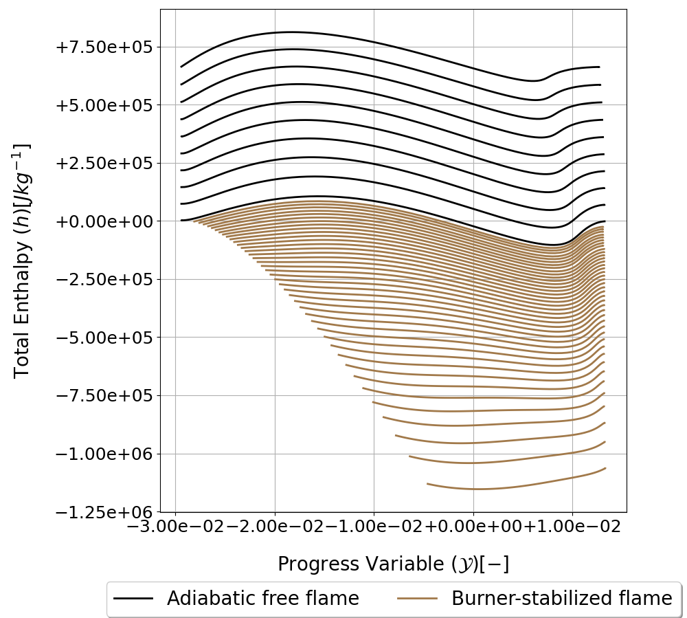
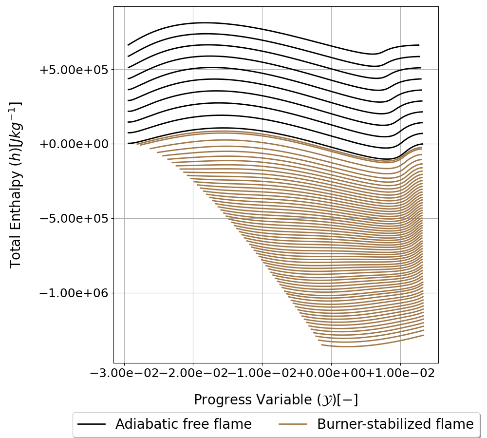

.. _flamelet_solver_burnerstabilized:

Burner-Stabilized Flamelet Solver
=================================

Burner-stabilized flaemlets are one-dimensional, premixed flamelets where the flame front is in close proximity to the inflow boundary.
As the inflow temperature is dictated by the boundary conditions, heat is conducted from the flame to the inflow boundary, reducing the enthalpy of the flame.
Including burner-stabilized flames in the manifold increases the variance in the total enthalpy by generating thermochemical data at **high values of the progress variable** and **low enthalpy**.
This is necessary for simulating flames subject to heat loss such as flames that are anchored on cooled surfaces, or modeling interactions between flames and cooled down-stream components such as heat exchangers.

The burner-stabilized flamelets are initialized similarly to :ref:`adiabatic flamelets <flamelet_solver_adiabatic>`, but more options are available for specifying the inflow boundary conditions.

.. autofunction:: Data_Generation.FlameletSolvers.BurnerFlameSolver.__init__ 

When initializing the burner-stabilized flamelet solver, the reaction mechanism, transport mechanism, and reactant temperature bounds are retrieved from the *SU2 DataMiner* configuration.
The :code:`BurnerFlameSolver` class is a wrapper for the Cantera `BurnerFlame <https://cantera.org/3.0/sphinx/html/cython/onedim.html#burnerflame>`_ class. 

Several tutorials for simulating burner-stabilized flamelets are posted on :ref:`this page <burnerflame_tutorial>`.

.. _burnerflames_inflow_conditions:

Inflow Conditions for Burner-Stabilized flamelets
-------------------------------------------------

Similarly to adiabatic flamelets, the inflow conditions for burner stabilized flamelets include the inflow temperature and mixture fraction or equivalence ratio. 
In addition, the **mass flux** is specified. The higher the mass flux, the larger the distance between the flame front and the cooled inflow boundary.

The mass flux can be specified with 

.. autofunction:: Data_Generation.FlameletSolvers.BurnerFlameSolver.setReactantMassFlow

When the mass flux is equal to that of an adiabatic flamelet, the solution of the burner-stabilized flamelet will be adiabatic as well. 
The value of the adiabatic mass flux can be retrieved from a converged adiabatic flamelet solution with :ref:`this function <adiabatic_mass_flux>`.

The temperature at the inflow boundary is by default set to **the lower limit of the reactant temperature** specified in the configuration, but can be changed with 

.. autofunction:: Data_Generation.FlameletSolvers.BurnerFlameSolver.setReactantTemperature

Creating Variance in the Total enthalpy
---------------------------------------

Variance in the total enthalpy of burner-stabilized flamelets is generated by gradually reducing the mass flux at the inflow boundary of the burner-stabilized flamelet simulation.
The inflow mass flux can be varied with two methods. 

The first option is to vary the mass flux for a specified number of samples linearly spaced **between 98% and 0.1% of the adiabatic value**. This is the default option.

The number of samples is retrieved from the :ref:`SU2 DataMiner configuration <FGM>` using the :code:`GetNpMdot` function. 

The second option is to specified the **change in total enthalpy at the inflow boundary** between adjacent burner-stabilized flamelet solutions. 
This option is enabled by specifying the enthalpy change in the :code:`BurnerFlameSolver` with 

.. autofunction:: Data_Generation.FlameletSolvers.BurnerFlameSolver.setTargetEnthalpySpacing

or in the configuration with :ref:`this function <enable_enth_delta_burnerflames>`.
The mass flux imposed at the inflow boundary of the next flamelet :math:`\dot{m}_{i+1}` is calculated with 

.. math::

    \dot{m}_{i+1} = \dot{m}_i - \Delta \dot{m}_i,

where :math:`\dot{m}_i` is the mass flux of the current flamelet and :math:`\Delta \dot{m}_i` the mass flux increment, calculated with

.. math::
    
    \Delta \dot{m}_i = f\Delta\dot{m}_{i-1}.

Here, :math:`\dot{m}_{i-1}` is the mass flux increment of the previous iteration and :math:`f` a scaling factor. 

The value of the scaling factor is dynamically updated based on the change in the total enthalpy at the inflow boundary

.. math::

    f = \max\left(\min\left(\frac{\Delta h_t}{\Delta h_i}, 5.0\right), 0.2\right),

where :math:`\Delta h_t` is the targeted value of the decrease in total enthalpy at the inflow boundary between adjacent flamelets and 

.. math::

    \Delta h_i = |h_i - h_{i-1}|,

where :math:`h_i` and :math:`h_{i-1}` are the total enthalpy evaluated at the inflow boundary of the current and previous flamelet.

The value of :math:`f` is clipped between 5.0 and 0.2 to maintain stability. 

The value of :math:`\Delta \dot{m}_0` is calculated with 

.. math::

    \Delta \dot{m}_0 = \frac{0.98 \dot{m}_{\mathrm{ad}} - 0.001\dot{m}_{\mathrm{ad}}}{N_{\dot{m}}}

where :math:`\dot{m}_\mathrm{ad}` is the value of the adiabatic mass flux and :math:`N_{\dot{m}}` is the number of mass flow rate samples specified in the configuration.

The two figures below show the trends of burner-stabilized flamelets where the mass flow varies according to the first method and according to the second method.

   Trends of adiabatic flamelets and of burner-stabilized flamelets with linearly varying the mass flux between 98% and 0.1% of the adiabatic value.

   Trends of adiabatic flamelets and of burner-stabilized flamelets with the inflow enthalpy change set to 2e4 J/kg.

The first method gives the user more control over the total number of burner-stabilized flamelets generated. However, the distribution of data points is inhomogeneous, with the majority of the data being generated close to adiabatic conditions.
With the second method, the distribution of data is more homogeneous, even at low enthalpy levels. However, it can be challenging to select the change in total enthalpy which will result in a desirable resolution, as this value will depend on the specific enthalpy of the reactants and the equivalence ratio.

